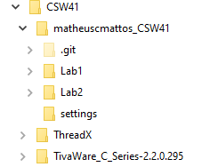
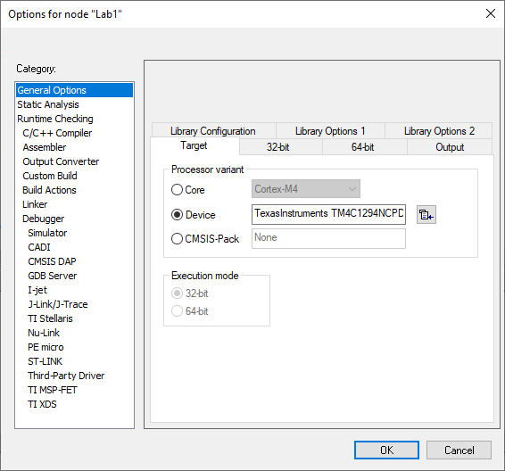
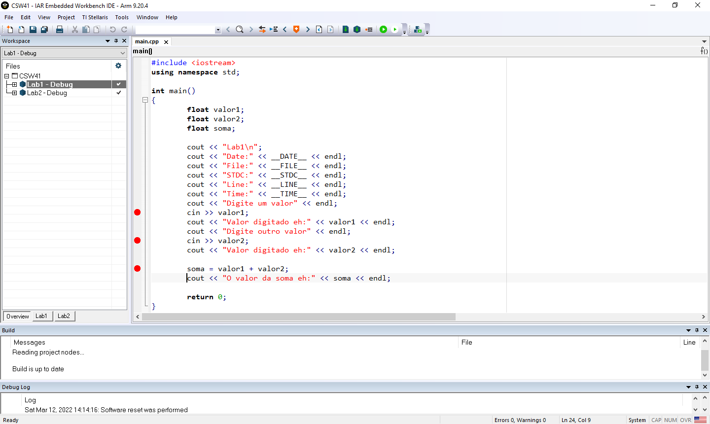
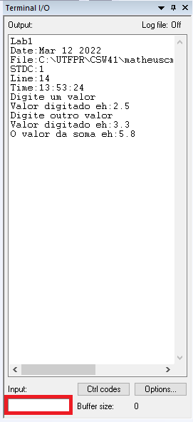
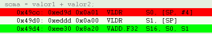
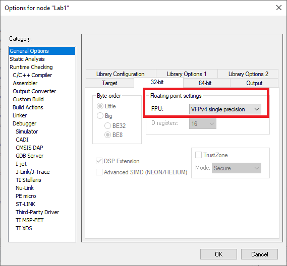

# Sistemas Embarcados CSW41

# LAB1

####Objetivo
Este laboratório consiste em configurar e validar todo o ambiente necessário para o desenvolvimento da disciplina de sistemas embarcados utilizando a IDE IAR e o kit da placa Tiva.

####Desenvolvimento
1. Primeiro passo foi baixar a IDE IAR Embedded Workbench for ARM (v 9.20).

2. Registrar como “Code size limited”.

3. Depois de instalado e devidamente licenciado conforme o manual de instalação fornecido pelo professor.

4. Foi necessário criar a estrutura de diretório para se seguir um padrão de organização para os próximos Labs, que pode ser visto na figura abaixo.

5. Para a criação do projeto foi utilizado o template de projeto disponibilizado pelo professor, pelo GitHub no usuário dougrenaux.
Com a utilização deste template todas as configurações do processador e depurador já estava setado.

7. Após essas configurações, foi possivel inicializar o desenvolvimento do Lab 1, que consiste em receber e enviar dados do terminal, conforme os pré-requisitos abaixo:
- Envie uma mensagem inicial.
- Apresente o valor de algumas símbolos pré-definidos (predefined preprocessor symbols), a exemplo de: __cplusplus __DATE__ __TIME__ __FILE__ __LINE__ __STDC__
__STDC_VERSION__ __ARM_ARCH __ARM_ARCH_ISA_THUMB
__ARM_SIZEOF_MINIMAL_ENUM __ARM_SIZEOF_WCHAR_T __ARMVFP__ __CORE__
- Ler (via cin) um valor em ponto flutuante (float)
- Somar a um outro valor em ponto flutuante (float)
- Apresentar o resultado da soma

8. Para a criação do código foi utilizado os seguintes símbolos pré-definidos.

9. Ao executar o programa é possível responder as seguintes perguntas abaixo:

- Onde aparecem as mensagem enviadas via cout ?
- Como entrar dados para leitura via cin ?

Tanto as mensagens enviadas via cout e as entradas de dado via cin, podem ser vista e inseridas no Terminal I/O, conforme a figura abaixo.

- Quais os valores dos símbolos pré-definidos que você escolheu ? o que significam ?

Os símbolos pré-definidos foram:

__DATE__ Puxa a data atual no formato dd/mm/aaaa e é tipo string.

__FILE__ O nome do arquivo de origem atual e é tipo string.

__LINE__ É o número da linha de origem atual.

__TIME__ Puxa a hora atual no formato hh:mm:ss e é tipo string.

Informações retiradas do guia de usuário da IAR. 
https://wwwfiles.iar.com/rl78/EWRL78_AssemblerReference.ENU.pdf

- Que tipo de instrução assembly foi usada para a soma dos dois valores float ?

Foi utilizado a intrução VLDR para carregar o valor 1 em S0 e o valor 2 em S1
Para a soma dos dois valores float foi utilizada a floating point VADD.F32.

Qual configuração do projeto no IAR causou o uso desta instrução ?

